# T.O.P.S
<ins><b>Physics Simulation Utilizing Verlet Integration</b></ins>

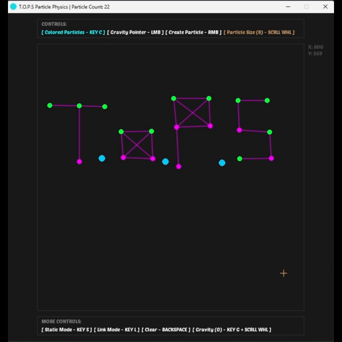

<ins><b>Totally Original Particle Simulation</b></ins> (or TOPS) is my first attempt at creating something similar to a physics engine/simulation, whilst utilizing [Verlet Integration](https://en.wikipedia.org/wiki/Verlet_integration). It isn't perfect, but I believe that it's a good introduction for me to gain a grasp at the mathematics at hand when programming physics related programs such as this. The program is built upon [LOVE2D](https://love2d.org) (specifically version 11.5, so I am not sure about its compatibility with future builds), so it only requires the LOVE interpreter to be run and otherwise is pretty much self contained without any other prerequisites. I mostly was I was just inspired to do this by random videos I found on youtube of people doing similar projects lmao

My goal has been to learn from this so that in future projects where I may write similar functionality, I'll have a non-nullar foundation to begin with and can bring it to the next level of complexity and variation with more ease, and yeah thats all lol

## Usage Guide

Here is a quick but comprehensive guide to the usage of the physics simulation and how to interact with its environment, it can be a bit confusing at first, but I couldn't pass by the opportunity of creating the UI in the style that I enjoy using. Also I do admit that I could have improved upon the organization and presentation of the controls panels, but I hope you may forgive me for this haha

### <i> 1. Particle Creation </i>

To create a particle, you can simply `RIGHT CLICK` with the mouse, and it will be instanced at the location of your cursor, as long as the cursor is within the boundaries of the box, which behaves as the "workspace". You may find the coordinates of your cursor within the box on the top right side of the window!

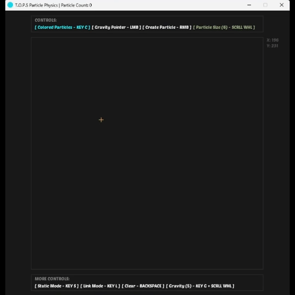

### <i> 2. The Gravity Pointer </i>

By holding the `LEFT MOUSE BUTTON`, you can generate a gravitational force separate from the vertical gravitational force already present, which emanates from your cursor, this can attract particles towards its position and is just generally fun to play around with lol

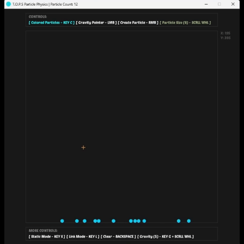

### <i> 3. Changing the Particle Sizes </i>

You can change the set particle size - which represents the particle's radius - by simply scrolling your `MOUSE WHEEL`, there are maximum and minimum values for the particles to prevent some weird stuff from happening. All generated particles are always created with the currently set particle size. You may also notice that the crosshair-like cursor changes size with the currently set particle size values as a way of correlating the two, I thought it's pretty cool so yeah

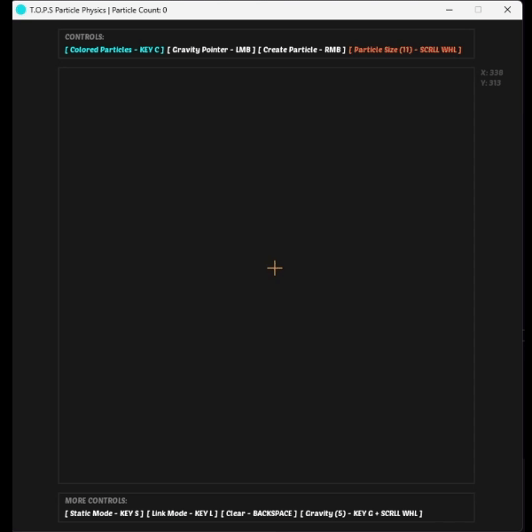

### <i> 4. Static Mode </i>

By pressing `S`, you can toggle static mode in the program, when a particle is instanced in static mode, instead of being created as a regular particle, is is created as a "static particle", if you will, which functions slightly differently as it always remains in a fixed place and isn't affected by forces such as gravity or kinetic interactions. That's pretty much all there is to them lol

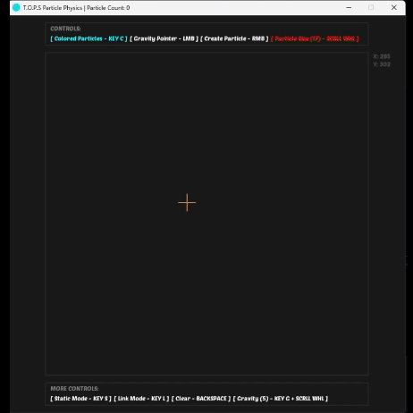

### <i> 5. Link Mode </i>

Now this one caused me a huge headache, and is the main reason I had to rewrite half the program whilst incorporating verlet integration, as straightforward as the concept of links may seem...
To clear it up, pressing `L` will place you into link mode, in which you can then click on two particles to "link" them together, which will force them to remain at a constant distance from each other all the time, which can be used to make some pretty fun stuff ngl. Pressing `L` again or clicking anywhere that isn't a particle will then turn off link mode.

  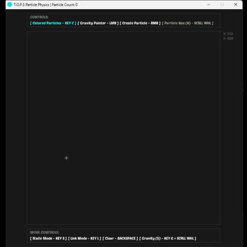
  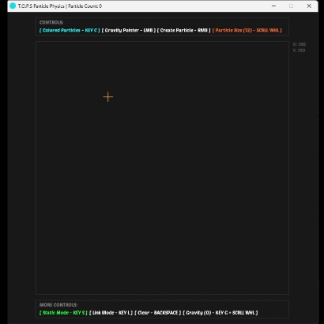
  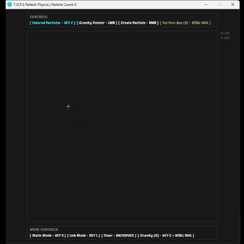
  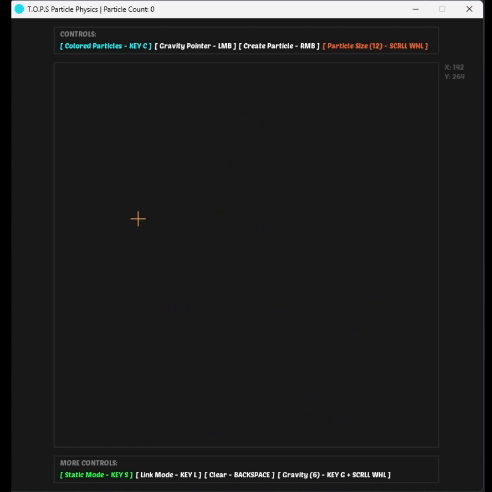

### <i> 6. Gravity Control </i>

In this simulation you're able to change the strength of gravity, and even make it negative! You can do this by holding the `G` key whilst scrolling back and forth with the `MOUSE WHEEL`.
This is fun to play around with in different situations, especially with linked structures!
And a word of advice from myself who's spent countless hours testing this program, is that it's much easier to link together particles that have been instanced at 0 gravity and therefore aren't moving, than to try and frantically click on a moving particle...

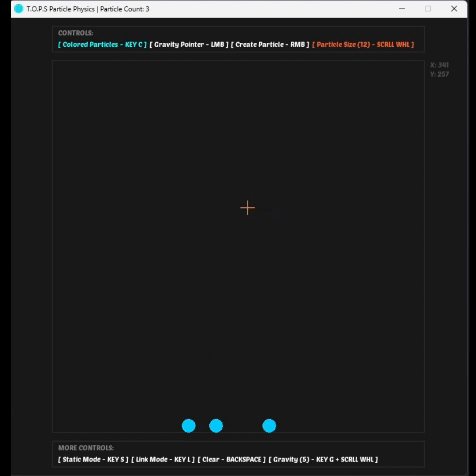

### <i> 7. Clearing the Workspace </i>

Well this is pretty self explanatory, isn't it? Pressing `BACKSPACE` will delete all current particles and links from the workplace, creating a new clean slate for you to use in the simulation space!

<i> (I didn't really create a demonstration for this one because I mean... it's kinda straightforward...) </i>

### <i> 8. Color-Coding Particles </i>

Well this one is simple, you can press `C` to toggle between the particles being colored or not, particles that are travelling at relatively high speeds appear to the red, lower speeds make them more blue-ish, static particles are always green and linked particles are always purple, it's really cool to be seeing all of the different colors on the workspace, but I understand that some may not like it, so I just added a feature to be able to toggle it around as you please!

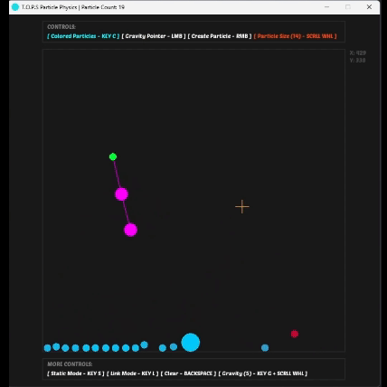

I've also included the video forms of the demonstrations in the repository, so if u need to you can look at them in better quality and detail :)
